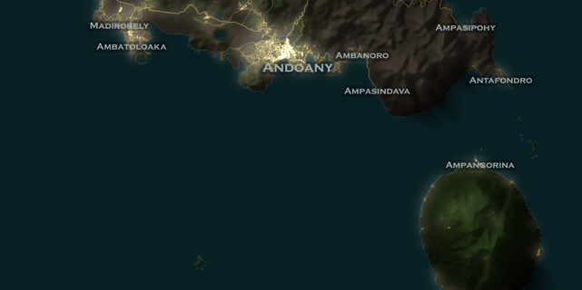
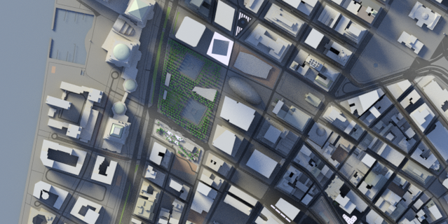
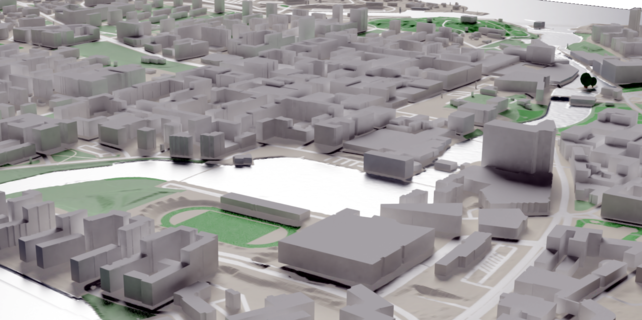
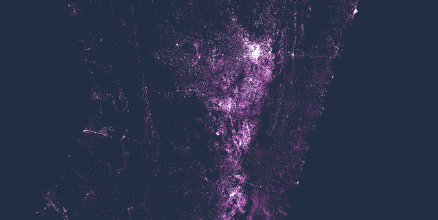

---
# Feel free to add content and custom Front Matter to this file.
# To modify the layout, see https://jekyllrb.com/docs/themes/#overriding-theme-defaults

layout: home
---

  <h2>Hello 👋</h2>
  Welcome to this page, where I share some maps and articles.

  
  
  
  
  
  
  
  
  

  <a href="/gallery" class="pageButton"> View my gallery </a>
  <a href="/blog" class="pageButton"> Visit my blog </a>

